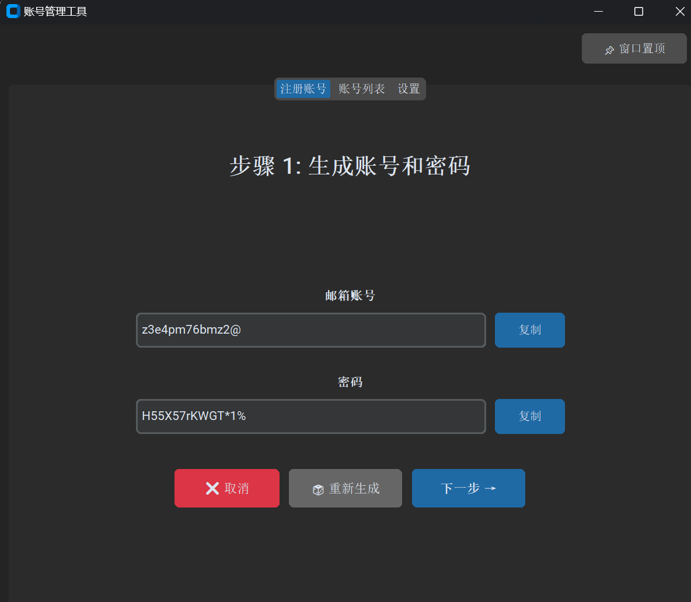
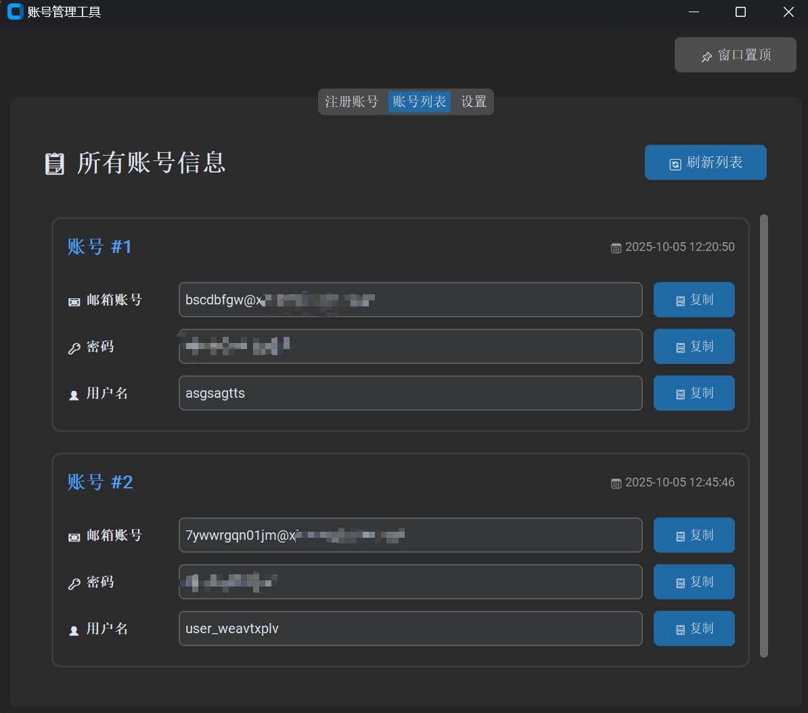
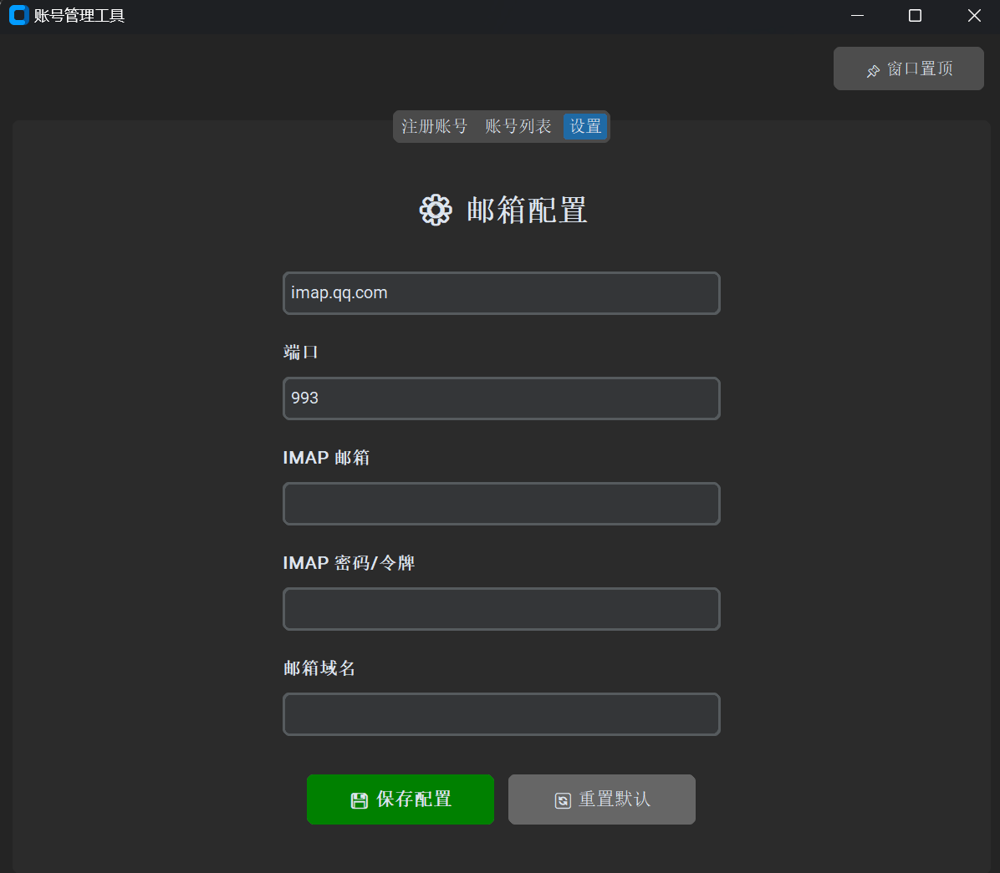

# 批量账号注册工具

一个使用IMAP邮箱实现批量注册某些平台账号（如谷歌，OpenAI等）和管理账号的软件

## 功能特点

- ✨ 现代化简约UI界面，页面切换式设计
- 📌 窗口置顶功能
- 🎲 自动生成账号和密码
- 📧 自动接收邮箱验证码
- 👤 自动生成用户名
- ❌ 取消注册功能（随时取消当前注册流程）
- 💾 本地保存账号信息
- 📋 查看所有账号列表（卡片式布局）
- 📄 一键复制功能
- ⚙️ IMAP邮箱配置（可配置自定义邮箱服务器）

## 界面预览

<div align="center">
  <table>
    <tr>
      <td></td>
      <td></td>
      <td></td>
    </tr>
    <tr>
      <td align="center">注册账号</td>
      <td align="center">账号列表</td>
      <td align="center">设置页面</td>
    </tr>
  </table>
</div>

## 安装依赖

```bash
pip install -r requirements.txt
```

## 使用方法

1. 首次使用 - 配置邮箱：
   - 运行程序后，点击"设置"标签页
   - 填写以下信息：
     - IMAP服务器：默认 `imap.qq.com`
     - 端口：默认 `993`
     - IMAP邮箱：你的接收邮箱（如：your_email@qq.com）
     - IMAP密码：QQ邮箱授权码（不是登录密码）
     - 邮箱域名：注册账号使用的域名（如：example.com）
   - 点击"💾 保存配置"

2. 注册账号流程：
   - 点击"注册账号"标签页
   - 步骤1：自动生成随机账号和密码，可复制使用，点击"下一步"
   - 步骤2：自动开始接收邮箱验证码，点击"下一步"
   - 步骤3：自动生成随机用户名
   - 点击"✓ 完成注册"保存账号信息
   - 注册过程中可随时点击"❌ 取消"放弃当前注册

3. 查看账号：
   - 点击"账号列表"标签页
   - 以卡片形式查看所有已注册的账号
   - 每个字段都有独立的"📋 复制"按钮
   - 点击"🔄 刷新列表"更新显示

## 邮箱配置说明

### QQ邮箱授权码获取方法：
1. 登录QQ邮箱网页版
2. 进入"设置" → "账户"
3. 找到"POP3/IMAP/SMTP/Exchange/CardDAV/CalDAV服务"
4. 开启"IMAP/SMTP服务"
5. 生成授权码

### 配置文件：
- 配置保存在 `config.json` 文件中
- 首次运行时会创建默认配置
- 可在"设置"标签页随时修改

## 数据存储

- `accounts.json` - 保存所有注册的账号信息
- `config.json` - 保存邮箱配置信息

## 技术栈

- Python 3.x
- CustomTkinter (现代化UI框架)
- IMAP (邮件接收)
- JSON (数据存储)
